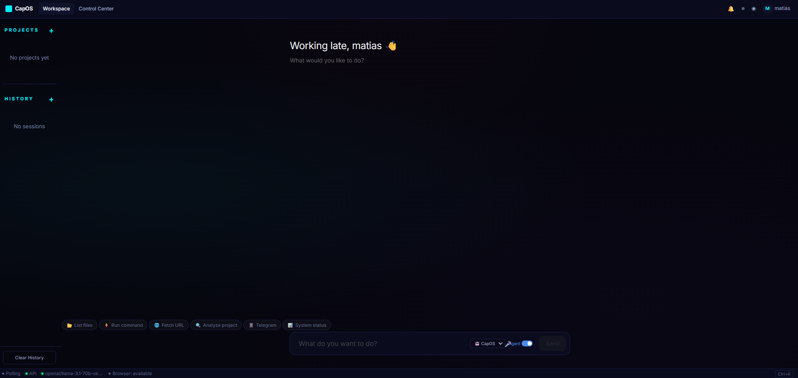

# Capability OS

<p align="center">
  
  
  
  
</p>

<p align="center">
  
  
  
  
  
</p>

<p align="center">
  
  
  
  
  
</p>

**AI-powered operating system with Plugin SDK, visual workflows, multi-user auth, and autonomous agents.**

<p align="center">
  
</p>

An extensible platform built on a distributed plugin architecture. 22 plugins manage everything from natural language understanding and tool execution to visual workflow building, multi-channel messaging, and proactive scheduling. 6 plugins run as independent Redis-backed worker processes for fault isolation and scalability. 5 LLM providers supported natively (Anthropic, OpenAI, Gemini, DeepSeek, Ollama).

```
python -m capabilityos serve       # start the server
python -m capabilityos chat        # interactive CLI chat
open http://localhost:8000         # web UI
```

---

## Quick Start

### Option 1: CLI (recommended)

```bash
pip install -r requirements.txt
cd system/frontend/app && npm install && npm run build && cd ../../..
python -m capabilityos serve
```

Open `http://localhost:8000`. On first visit you'll see the owner setup page.

### Option 2: Launcher

**Windows:** Double-click **`CapabilityOS.bat`**

**Mac/Linux:**
```bash
chmod +x start.sh
./start.sh                    # foreground
./start.sh --background       # background (opens browser)
./start.sh --port 9000        # custom port
```

### PWA (Installable App)

On first visit, Chrome will offer to install CapOS as a desktop app. This creates a shortcut that opens CapOS in its own window (no address bar), with offline caching and push notifications.

> **Note:** The PWA is just the frontend — you still need to start the backend server first. The shortcut opens `localhost:8000`, so the server must be running.

**Auto-start script (Windows):** save as `CapOS.bat` on your desktop:

```bat
@echo off
cd /d C:\path\to\capability-os
start /min python -m capabilityos serve
timeout /t 3 >nul
start "" "http://localhost:8000"
```

### Option 3: Docker

```bash
docker compose up --build
```

### Configure LLM

Set your provider in Settings or via environment variables:

```bash
# Anthropic (recommended)
LLM_PROVIDER=anthropic ANTHROPIC_API_KEY=sk-ant-...

# OpenAI
LLM_PROVIDER=openai OPENAI_API_KEY=sk-...

# Groq (free tier available)
LLM_PROVIDER=openai LLM_BASE_URL=https://api.groq.com/openai/v1 OPENAI_API_KEY=gsk_...

# Ollama (local, no key needed)
LLM_PROVIDER=ollama

# Gemini
LLM_PROVIDER=gemini GEMINI_API_KEY=...

# DeepSeek
LLM_PROVIDER=deepseek DEEPSEEK_API_KEY=...
```

---

## Features

### Autonomous Agent
The LLM calls tools iteratively, observes results, retries on errors, and explains everything in natural language. Custom agents with unique system prompts, tool selections, and model overrides can be created and assigned to projects.

```
You: "analyze my project and create a summary"
Agent: [calls filesystem_list_directory] → scans structure
       [calls read_file] → reads key files
       [calls write_file] → creates summary.md
       "Done! I analyzed 47 files and wrote a summary to summary.md"
```

### Plugin Architecture
22 built-in plugins running via ServiceContainer with dependency-ordered initialization, typed Protocol contracts, and hot-reload support. 6 plugins run as Redis-backed worker processes for fault isolation. Create custom plugins with `capos-plugin.json` + `plugin.py`.

| Plugin | ID | Purpose |
|--------|----|---------|
| Core Services | `capos.core.settings` | Settings, registries, security, health, metrics |
| Auth | `capos.core.auth` | JWT auth, user registry, 4 roles |
| Memory | `capos.core.memory` | Execution history, semantic memory, MEMORY.md |
| Capabilities | `capos.core.capabilities` | Capability engine, plan builder |
| Workspace | `capos.core.workspace` | Project management, file browser |
| Agent | `capos.core.agent` | Autonomous agent loop, agent registry |
| Skills | `capos.core.skills` | Skill registry and loader |
| Browser | `capos.core.browser` | Playwright / CDP browser automation |
| Voice | `capos.core.voice` | STT and TTS services |
| MCP | `capos.core.mcp` | Model Context Protocol client |
| A2A | `capos.core.a2a` | Agent-to-Agent protocol |
| Growth | `capos.core.growth` | Gap analysis, auto-install pipeline |
| Sequences | `capos.core.sequences` | Multi-step sequence runner |
| Supervisor | `capos.core.supervisor` | Claude bridge, health monitor, security auditor |
| Scheduler | `capos.core.scheduler` | Proactive task queue (cron cycles) |
| Telegram | `capos.channels.telegram` | Telegram bot polling + auto-reply |
| Slack | `capos.channels.slack` | Slack bot polling + auto-reply |
| Discord | `capos.channels.discord` | Discord bot polling + auto-reply |
| WhatsApp | `capos.channels.whatsapp` | 3 backends: Browser, Baileys, Official API |
| Workflows | `capos.core.workflows` | Visual workflow builder + executor |
| Sandbox | `capos.core.sandbox` | Process (L2) + Docker (L3) sandboxes |
| Integrations | `capos.core.integrations` | Integration registry and lifecycle |

### Visual Workflow Builder
Drag-and-drop workflow editor powered by ReactFlow with 13 node types: Trigger, Tool, Agent, Condition, Loop, Delay, Transform, Output, HTTP Request, Notification, Script, AI Prompt, and File. Includes 5 pre-built templates, AI workflow designer chat, auto-save, and per-node execution preview. Workflows are persisted and executed via topological sort.

### Multi-User Authentication
JWT-based auth with 4 roles:

| Role | Permissions |
|------|-------------|
| **owner** | Full access, user management, system config |
| **admin** | All features except owner transfer |
| **user** | Chat, workspaces, agent interaction |
| **viewer** | Read-only access |

First-time setup creates the owner account via `/auth/setup`.

### Progressive Security (3 Levels)
| Level | Action | Example |
|-------|--------|---------|
| **1 -- Free** | Read-only, no confirmation | Read files, list dirs, send messages |
| **2 -- Confirm** | User clicks "Allow" | Write files, run commands |
| **3 -- Password** | Password/2FA required | Delete system files, modify OS settings |

### Execution Sandbox
| Level | Method | Use Case |
|-------|--------|----------|
| **L2 -- Process** | `subprocess` with timeout + memory limits | Fast, default for tool execution |
| **L3 -- Docker** | Isolated container with resource caps | Untrusted code, plugin testing |

### Multi-Channel Messaging
| Channel | Status | Features |
|---------|--------|----------|
| **WhatsApp** | 3 backends | Browser (Puppeteer), Baileys, Official Cloud API |
| **Telegram** | Ready | Polling + auto-reply via agent |
| **Slack** | Ready | Polling + auto-reply |
| **Discord** | Ready | Polling + auto-reply |

### Distributed Workers (Redis)

Plugins with heavy I/O automatically run as separate processes when Redis is available:

```
Without Redis (personal):     With Redis (production):
┌──────────────────┐          ┌──────────────┐    ┌────────────────┐
│  Single Process   │          │  Main Process │◄──►│ Redis          │
│  (all plugins)    │          │  (10 core)    │    └───────┬────────┘
└──────────────────┘          └──────────────┘            │
                                                ┌────────┼────────┐
                                                │        │        │
                                              Workers  Workers  Workers
                                              (channels)(sched) (super)
```

Workers: Telegram, Slack, Discord, WhatsApp, Scheduler, Supervisor. Each with auto-restart, heartbeat, and graceful shutdown.

### Integrated IDE
Monaco-based code editor with file explorer, terminal, workspace analysis, auto-clean, and README generation.

### Frontend SDK
All frontend-to-backend communication goes through a centralized SDK layer (`src/sdk/`):

```js
import sdk from "./sdk";

// HTTP (auth injected automatically)
const caps = await sdk.capabilities.list();
await sdk.system.settings.save({ llm: { model: "gpt-4o" } });

// Streaming with JWT auth
for await (const chunk of sdk.capabilities.streamChat("hello", "User")) { ... }

// Real-time events (replaces polling)
sdk.events.on("telegram_message", (e) => console.log(e.data.text));
sdk.events.on("*", handler); // wildcard

// Session persistence
sdk.session.saveChatMessages(messages); // survives page refresh
```

13 domain modules: `agents`, `capabilities`, `integrations`, `memory`, `system`, `workspaces`, `mcp`, `a2a`, `workflows`, `skills`, `growth`, `auth`. See [Frontend Architecture](docs/FRONTEND_ARCHITECTURE.md).

### Supervisor
Background system that monitors health, detects capability gaps, audits security, and can invoke Claude Code for auto-repair.

### Proactive Scheduler
Three-cycle task system: Quick (30min), Deep (4h), Daily. Supports cron-style scheduling with agent-executed tasks.

### Memory System
- **Execution History** -- full session replay with search
- **Semantic Memory** -- sqlite-vec vector store (100x faster than JSON)
- **Markdown Memory** -- MEMORY.md with sections, daily notes, auto-compaction
- **User Context** -- preferences, display names, per-workspace state

---

## Architecture

```
                        HTTP / WebSocket
                              |
                    +---------+---------+
                    |   ASGI (uvicorn)  |  ThreadPool(32) + SSE streaming
                    +---------+---------+
                              |
                    +---------+---------+
                    |      Router       |  180+ endpoints
                    +---------+---------+
                              |
              +---------------+---------------+
              |               |               |
        Auth (JWT)     Handler Modules     Static Files
              |           (19 modules)
              |               |
              |    +----------+----------+
              |    |  ServiceContainer   |  Plugin lifecycle + DI
              |    +----------+----------+
              |               |
         +----+----+   +-----+-----+   +----------+
         |10 Core  |   | EventBus  |   |  Redis   |
         |Plugins  |   | (bridge)  |◄─►| (queue)  |
         |(in-proc)|   +-----+-----+   +----+-----+
         +---------+         |              |
                        +----+----+    +----+-----+
                        |WebSocket|    | 6 Worker |
                        | Server  |    | Processes|
                        |(200 max)|    +----------+
                        +---------+    | telegram |
                                       | slack    |
                                       | discord  |
                                       | whatsapp |
                                       | scheduler|
                                       | supervisor|
                                       +----------+
```

### Plugin Dependency Graph

```
core_services (root)
  +-- auth
  +-- memory
  |     +-- capabilities
  |     |     +-- workspace
  |     |     +-- growth
  |     +-- agent
  |           +-- supervisor
  |           +-- scheduler
  |           +-- skills
  +-- browser
  +-- voice
  +-- mcp
  +-- a2a
  +-- sequences
  +-- workflows
  +-- sandbox
  +-- channels/telegram
  +-- channels/slack
  +-- channels/discord
  +-- channels/whatsapp
```

---

## Plugin SDK

Create a plugin with two files:

**`capos-plugin.json`**
```json
{
  "id": "my-org.my-plugin",
  "name": "My Plugin",
  "version": "1.0.0",
  "description": "What it does",
  "plugin_types": ["tool"],
  "dependencies": ["capos.core.settings"],
  "entry_point": "plugin:create_plugin"
}
```

**`plugin.py`**
```python
from system.sdk.context import PluginContext

class MyPlugin:
    plugin_id = "my-org.my-plugin"
    plugin_name = "My Plugin"
    version = "1.0.0"
    dependencies = ["capos.core.settings"]

    def initialize(self, ctx: PluginContext) -> None:
        settings = ctx.plugin_settings(self.plugin_id)
        tool_runtime = ctx.get_service(ToolRuntimeContract)
        # register tools, publish services, etc.

    def start(self) -> None:
        pass  # start background threads if needed

    def stop(self) -> None:
        pass  # cleanup

def create_plugin():
    return MyPlugin()
```

Install and hot-reload:
```bash
python -m capabilityos plugins install ./my-plugin
# or via API:
POST /plugins/install  {"path": "./my-plugin"}
POST /plugins/my-org.my-plugin/reload
```

See the [Wiki](wiki/) for full documentation: [Plugin Development](wiki/Plugin-Development.md), [Frontend SDK](wiki/Frontend-SDK.md), [Architecture](wiki/Architecture.md), [API Reference](wiki/API-Reference.md).

---

## CLI Reference

```
python -m capabilityos <command> [options]
```

| Command | Description | Options |
|---------|-------------|---------|
| `chat [message]` | Interactive chat or one-shot | `--agent/-a`, `--workspace/-w` |
| `status` | System status and plugin health | |
| `serve` | Start the server | `--port/-p 8000`, `--host`, `--sync` |
| `plugins list` | List all plugins and their state | |
| `plugins install <path>` | Install a plugin from directory | |
| `version` | Show version | |

---

## API Reference

180+ endpoints organized by module. All endpoints accept/return JSON.

### Auth
| Endpoint | Method | Description |
|----------|--------|-------------|
| `/auth/setup` | POST | Create owner account (first-time) |
| `/auth/login` | POST | Login, returns JWT |
| `/auth/me` | GET | Current user info |
| `/auth/users` | GET/POST | List / create users |
| `/auth/users/{id}` | PUT/DELETE | Update / delete user |

### System
| Endpoint | Method | Description |
|----------|--------|-------------|
| `/status` | GET | System status |
| `/health` | GET | Health check |
| `/settings` | GET/POST | Read / write settings |
| `/llm/test` | POST | Test LLM connection |
| `/system/export-config` | GET | Export full config |
| `/system/import-config` | POST | Import config |
| `/logs` | GET | Recent logs |

### Agent
| Endpoint | Method | Description |
|----------|--------|-------------|
| `/agent` | POST | Start autonomous agent session |
| `/agent/confirm` | POST | Confirm/deny Level 2/3 action |
| `/agent/{session_id}` | GET | Get session state |
| `/agents` | GET/POST | List / create custom agents |
| `/agents/{id}` | GET/POST/DELETE | CRUD agent definition |
| `/agents/design` | POST | AI designs an agent from description |

### Capabilities
| Endpoint | Method | Description |
|----------|--------|-------------|
| `/capabilities` | GET | List all capabilities |
| `/capabilities/{id}` | GET | Get capability detail |
| `/execute` | POST | Execute capability |
| `/chat` | POST | Chat with classification |
| `/interpret` | POST | Interpret natural language |
| `/plan` | POST | Generate execution plan |

### Workspaces
| Endpoint | Method | Description |
|----------|--------|-------------|
| `/workspaces` | GET/POST | List / create projects |
| `/workspaces/{id}` | GET/POST/DELETE | CRUD workspace |
| `/workspaces/{id}/status` | POST | Update project status |
| `/workspaces/{id}/browse` | GET | Browse workspace files |

### Memory
| Endpoint | Method | Description |
|----------|--------|-------------|
| `/memory/context` | GET | Agent memory context |
| `/memory/history` | GET | Execution history |
| `/memory/semantic` | POST | Add semantic memory |
| `/memory/semantic/search` | GET | Search vector store |
| `/memory/markdown` | GET/POST | Read/write MEMORY.md |
| `/memory/markdown/fact` | POST/DELETE | Add/remove facts |
| `/memory/daily` | GET | Daily notes |
| `/memory/compact` | POST | Compact old sessions |

### Workflows
| Endpoint | Method | Description |
|----------|--------|-------------|
| `/workflows` | GET/POST | List / create workflows |
| `/workflows/{id}` | GET/PUT/DELETE | CRUD workflow |
| `/workflows/{id}/run` | POST | Execute workflow |
| `/workflows/{id}/layout` | POST | Save canvas layout |

### Plugins
| Endpoint | Method | Description |
|----------|--------|-------------|
| `/plugins` | GET | List all plugins + status |
| `/plugins/{id}` | GET | Plugin detail |
| `/plugins/{id}/reload` | POST | Hot-reload plugin |
| `/plugins/install` | POST | Install from path |

### Scheduler
| Endpoint | Method | Description |
|----------|--------|-------------|
| `/scheduler/tasks` | GET/POST | List / create tasks |
| `/scheduler/tasks/{id}` | POST/DELETE | Update / delete task |
| `/scheduler/tasks/{id}/run` | POST | Run task immediately |
| `/scheduler/status` | GET | Scheduler status |

### Files / IDE
| Endpoint | Method | Description |
|----------|--------|-------------|
| `/files/tree` | GET | File tree |
| `/files/read` | GET | Read file |
| `/files/write` | POST | Write file |
| `/files/terminal` | POST | Execute terminal command |
| `/files/analyze/{ws_id}` | GET | Analyze workspace |

### Channels & Integrations
| Endpoint | Method | Description |
|----------|--------|-------------|
| `/integrations` | GET | List all integrations |
| `/integrations/whatsapp/*` | Various | WhatsApp management |
| `/integrations/telegram/*` | Various | Telegram management |
| `/integrations/slack/*` | Various | Slack management |
| `/integrations/discord/*` | Various | Discord management |

### MCP + A2A
| Endpoint | Method | Description |
|----------|--------|-------------|
| `/mcp/servers` | GET/POST | List / add MCP servers |
| `/mcp/tools` | GET | List discovered tools |
| `/.well-known/agent.json` | GET | A2A agent card |
| `/a2a` | POST | Handle A2A task |
| `/a2a/agents` | GET/POST | Manage known agents |

---

## Configuration

### Settings File

`system/settings.json` (copy from `system/settings.example.json`):

```json
{
  "llm": {
    "provider": "anthropic",
    "base_url": "https://api.anthropic.com",
    "model": "claude-sonnet-4-20250514",
    "api_key": "YOUR_KEY",
    "timeout_ms": 30000
  },
  "redis": {
    "enabled": true,
    "url": "redis://127.0.0.1:6379/0"
  },
  "browser": {
    "backend": "playwright",
    "auto_start": false,
    "cdp_port": 0
  },
  "agent": {
    "enabled": true,
    "max_iterations": 10
  },
  "auth": {
    "jwt_expiry_hours": 24,
    "require_login": true
  },
  "sandbox": {
    "process_timeout": 30,
    "docker_timeout": 60,
    "docker_image": "python:3.12-slim",
    "max_memory_mb": 512
  },
  "voice": {
    "stt_provider": "whisper",
    "tts_provider": "edge-tts"
  },
  "workflows": {
    "max_concurrent": 5,
    "default_timeout_s": 300
  },
  "whatsapp": {
    "backend": "browser",
    "allowed_user_ids": []
  },
  "telegram": {
    "bot_token": "",
    "polling_enabled": false
  },
  "slack": {
    "bot_token": "",
    "polling_enabled": false
  },
  "discord": {
    "bot_token": "",
    "polling_enabled": false
  },
  "a2a": {
    "enabled": true,
    "known_agents": []
  },
  "mcp": {
    "servers": [],
    "auto_discover_capabilities": false
  }
}
```

---

## Development

### Requirements
- Python 3.12+
- Node.js 18+
- Redis (optional — system works without it, but enables distributed workers)
- Optional: `pip install playwright && python -m playwright install chromium`

### Install Dependencies
```bash
pip install -r requirements.txt
cd system/frontend/app && npm install && npm run build && cd ../../..
```

Core Python dependencies: `bcrypt`, `PyJWT`, `uvicorn`, `redis`, `anthropic`, `sqlite-vec`

### Run Tests
```bash
python -m pytest tests/ -v
cd system/frontend/app && npx vitest run
```

### Verification Agent
```bash
python scripts/verify.py
```

### Project Structure
```
capability-os/
+-- capabilityos/                   # CLI package
|   +-- cli/                        # chat, serve, status, plugins
+-- system/
|   +-- sdk/                        # Plugin SDK (contracts, context, lifecycle)
|   +-- container/                  # ServiceContainer, plugin loader, hot-reload
|   +-- infrastructure/             # Redis queues, worker processes, event bridge
|   +-- workers/                    # Channel/scheduler/supervisor worker scripts
|   +-- plugins/                    # 22 built-in plugins
|   |   +-- core_services/          # Settings, registries, security
|   |   +-- auth/                   # JWT, user registry, middleware
|   |   +-- memory/                 # History, semantic, markdown
|   |   +-- capabilities/           # Engine, plan builder
|   |   +-- workspace/              # Projects, file browser
|   |   +-- agent/                  # Agent loop, registry
|   |   +-- skills/                 # Skill registry
|   |   +-- browser/                # Playwright / CDP
|   |   +-- voice/                  # STT + TTS
|   |   +-- mcp/                    # Model Context Protocol
|   |   +-- a2a/                    # Agent-to-Agent
|   |   +-- growth/                 # Gap analysis, auto-install
|   |   +-- sequences/              # Multi-step runner
|   |   +-- supervisor/             # Health monitor, Claude bridge
|   |   +-- scheduler/              # Proactive task queue
|   |   +-- workflows/              # Visual workflow builder
|   |   +-- sandbox/                # Process + Docker sandbox
|   |   +-- channels/               # telegram, slack, discord, whatsapp
|   +-- core/                       # Service implementations
|   |   +-- agent/                  # Agent loop, state, tool adapter
|   |   +-- auth/                   # UserRegistry, JWTService
|   |   +-- security/               # Progressive security (3 levels)
|   |   +-- interpretation/         # Intent classification, LLM client
|   |   +-- capability_engine/      # Strategy execution
|   |   +-- workflow/               # WorkflowRegistry, WorkflowExecutor
|   |   +-- sandbox/                # SandboxManager
|   |   +-- supervisor/             # HealthMonitor, ErrorInterceptor
|   |   +-- scheduler/              # ProactiveScheduler, TaskQueue
|   |   +-- memory/                 # All memory backends
|   |   +-- workspace/              # Workspace registry, file browser
|   |   +-- observation/            # Logging, error notifier
|   |   +-- ui_bridge/              # Router, handlers, event bus, WS server
|   |   +-- voice/                  # STT + TTS
|   |   +-- mcp/                    # MCP client, tool bridge
|   |   +-- a2a/                    # A2A server + client
|   |   +-- skills/                 # Skill manifest, registry, loader
|   |   +-- health/                 # Health service
|   |   +-- metrics/                # Metrics collector
|   +-- tools/                      # Tool contracts + runtime handlers
|   +-- capabilities/               # Capability contracts + executors
|   +-- integrations/               # Channel connectors (WA, TG, Slack, Discord)
|   +-- frontend/app/               # React 18 + Vite + ReactFlow + SDK
|   |   +-- src/sdk/                # Frontend SDK (13 domain modules)
|   |   +-- src/components/         # UI components (16 CC sections, workflow, etc.)
|   +-- whatsapp_worker/            # Node.js workers (Baileys + Puppeteer)
+-- tests/                          # Unit tests
+-- scripts/                        # verify.py, security_audit.py
+-- wiki/                           # GitHub wiki (10 pages)
+-- docker-compose.yml              # Docker with Redis + Chrome
+-- Dockerfile
+-- start.sh                        # Mac/Linux launcher
+-- CapabilityOS.bat                # Windows launcher
```

---

## Changelog

### v3.2 (Current)
- **Distributed workers** -- 6 plugins (Telegram, Slack, Discord, WhatsApp, Scheduler, Supervisor) run as Redis-backed subprocesses with auto-restart and heartbeat. Falls back to in-process without Redis.
- **5 LLM providers** -- Anthropic (SDK), OpenAI, Gemini, DeepSeek, Ollama all fully functional with tool calling
- **Redis infrastructure** -- MessageQueue, EventBridge, WorkerProcess, WorkerRegistry, RedisCache
- **Agent sessions in Redis** -- survive process restarts, enable cross-process recovery
- **Settings thread safety** -- RLock + atomic file writes prevent corruption
- **Rate limiter enforced** -- LLM rate limits now wait instead of rejecting
- **SQLite thread safety** -- thread-local read connections for concurrent access
- **Configurable server** -- thread pool (32 default) and WebSocket limit (200 default) via env vars
- **13 workflow node types** -- HTTP, Notification, Script, AI Prompt, File + 8 original
- **AI Workflow Designer** -- chat generates workflows from natural language
- **5 workflow templates** -- Monitor+Notify, File Processing, Agent Chain, Scheduled Report, Web Scraper
- **ErrorBoundary** -- prevents white screen of death on React errors
- **Repo cleanup** -- 30 obsolete files removed, gitignore updated

### v3.1
- **Frontend SDK** -- single gateway to backend (HTTP + SSE + WebSocket), 13 domain modules
- **ControlCenter refactored** -- 848 lines split into 16 independent section components
- **Session persistence** -- chat survives page refresh (sessionStorage)
- **Event-driven UI** -- sdk.events replaces polling, typed event catalog (24 types)
- **PWA support** -- installable app, Service Worker caching, push notifications
- **8 messaging channels** -- WhatsApp, Telegram, Slack, Discord + Signal, Matrix, Teams, Email, Webhook (UI ready)
- **55 frontend tests** + GitHub Actions CI
- **NotificationCenter** -- real-time activity feed with tab filters

### v3.0
- **Plugin SDK** -- typed Protocol contracts, ServiceContainer with Kahn's topological sort
- **21 plugins** -- modular architecture replacing the monolith
- **Multi-user auth** -- JWT, 4 roles (owner/admin/user/viewer), login page
- **Visual Workflow Builder** -- ReactFlow canvas, 8 node types, topological executor
- **Execution Sandbox** -- L2 (process) + L3 (Docker) isolation
- **sqlite-vec vector store** -- 100x faster semantic search
- **CLI** -- `python -m capabilityos {chat,status,serve,plugins,version}`
- **Hot-reload** -- reload individual plugins without restarting
- **Markdown memory** -- MEMORY.md, daily notes, auto-compaction
- **ASGI server** -- uvicorn with sync fallback
- **180+ endpoints** -- organized into 19 handler modules
- **Supervisor** -- Claude bridge, health monitor, gap detector, security auditor
- **Proactive Scheduler** -- 3-cycle task system (30min/4h/daily)
- **Integrated IDE** -- Monaco editor, file explorer, terminal
- **Plugin management API** -- list, install, reload via REST

### v2.0
- Autonomous Agent Loop with error recovery
- Progressive Security (3 levels)
- Custom Agents with AI designer
- 3 WhatsApp Backends (Browser, Baileys, Official)
- Project Workspaces with states and icons
- Cyberpunk UI theme
- Launcher dashboard
- Error Notifier with Claude Code integration

### v1.0
- Conversational UI, session management
- MCP + A2A integration
- Semantic memory
- Self-improvement system
- Browser worker (CDP)

---

## License

MIT
